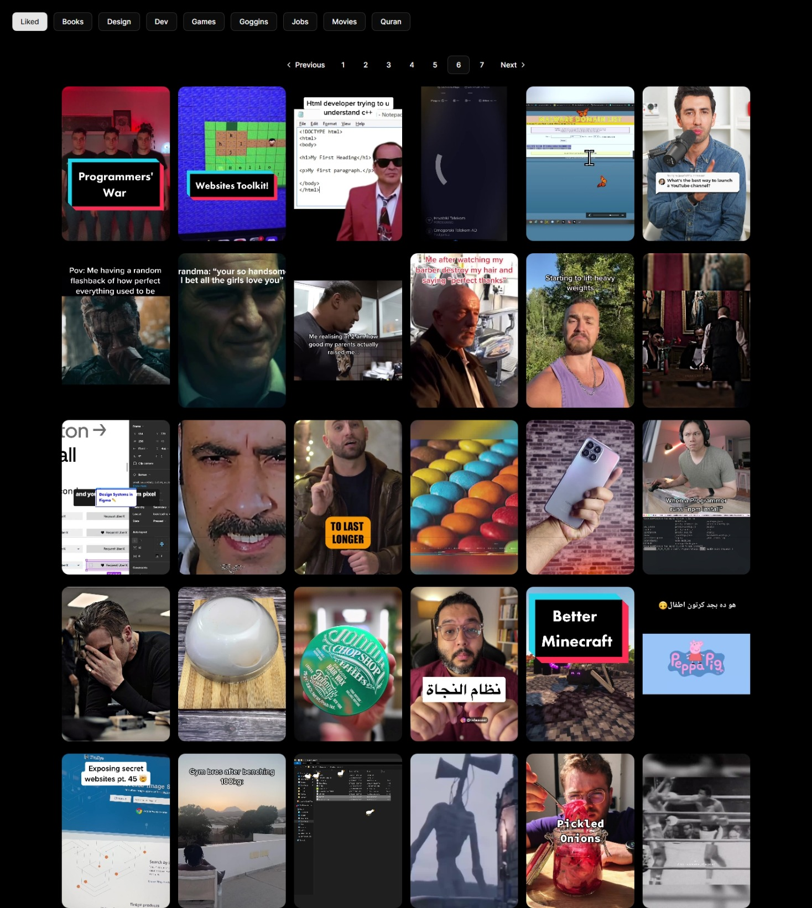
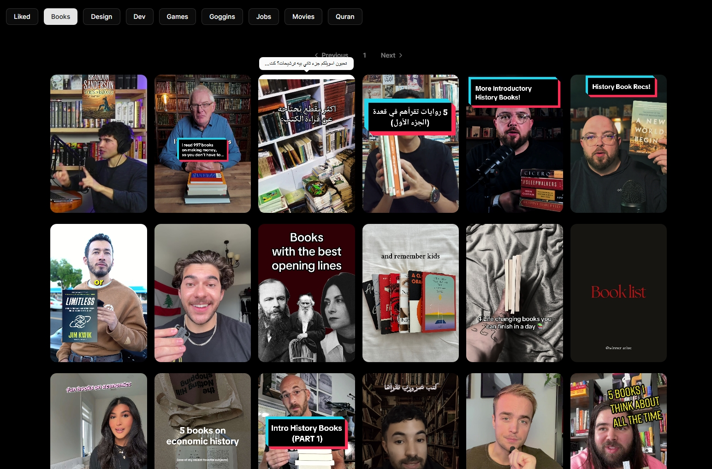

# **Project Documentation — TikTok Saved Videos Backup Viewer**

> Start at: nov 17, 2025

## **Overview**

This project provides a simple web interface for displaying your saved TikTok videos after deleting your TikTok account. Instead of losing all your “Liked” or “Saved” videos, this tool allows you to export them, organize them, and present them neatly on your own website.

The app uses a lightweight React setup with dynamic imports to split large datasets into multiple files. This boosts performance and makes it easier for anyone to clone the project, add their own data, and instantly get a working backup viewer without touching TikTok again.

> **And yes… my videos are publicly available in this demo.
> Enjoy judging my taste in content — I accept no responsibility for your reactions.**

---

## **Screenshot**




## **Features**

### **1. Fully Local & Private**

No backend, no APIs, no servers. Everything is stored in JSON files that you generate yourself.

### **2. Dynamic Imports for Better Performance**

The dataset is automatically split into multiple files (e.g., 30 items per file).
Pagination buttons load each chunk only when needed.

### **3. Categories Based on Video Type**

Your saved videos are grouped by category (e.g., funny, educational, fitness, etc.) for easier browsing.

### **4. Easy to Clone & Reuse**

Anyone can:

-   Export their TikTok saved videos
-   Place the generated JSON files into the `/data` folder
-   Launch the site
    …and it just works.

---

# **How to Export Your TikTok Saved Videos (Your Data)**

Follow these steps carefully:

### **Step 1 — Open TikTok “Liked Videos” Page**

Go to the page showing all your liked/saved videos.

### **Step 2 — Scroll to the Bottom**

Keep scrolling until **every video is loaded**.
TikTok loads content lazily, so missing this step will give you incomplete data.

### **Step 3 — Open Developer Tools Console**

-   Right-click → _Inspect_
-   Go to the **Console** tab

### **Step 4 — Paste the Script Below**

Paste this code into the console and press **Enter**:

```js
let items = document.querySelectorAll("[id^='column-item-video-container']");
let result = [];

items.forEach((el) => {
    try {
        let link = el.querySelector("a")?.href || "";
        let img = el.querySelector("img")?.src || "";
        let title = el.querySelector("img")?.alt || "";
        let views =
            el.querySelector("[data-e2e='video-views']")?.innerText || "";

        result.push({
            link,
            img,
            title,
            views,
        });
    } catch (e) {}
});

// Copy result as JSON
copy(result);
```

### **Step 5 — Paste the Copied JSON into a File**

Create a file named something like:

```
data-1.json
```

If you have many videos, you can split them into multiple files (30 per file recommended).

### **Step 6 — Place Files in the Project**

Put all JSON files inside the project’s `/data` folder.

### **Step 7 — Done**

The site will automatically load all your data via dynamic imports.
Now you can delete your TikTok account without worrying about losing your saved content.

---

## **Tech Stack**

-   **React**
-   **Dynamic Imports (import())**
-   **Vite**
-   **TypeScript**
-   **Static JSON Data Files**
-   **Simple Pagination Component**

---

## **Why I Built This**

I wanted a quick way to archive my saved TikTok videos before deleting my account. And since I built it fast and kept it clean, now **anyone** can reuse the idea.

Also… I made my videos publicly viewable on the demo site.
So feel free to explore my questionable taste in content.

---
